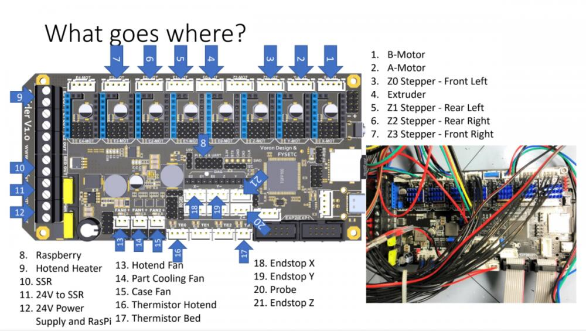
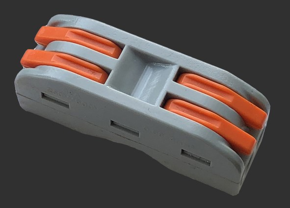

# FYSETC-VORON-2.4

## Project

This is FYSETC's project database for VORON 2.4 kit, which is convenient for you to find information. Thanks for VORON Team's great work, they always design fantastic printers.

Official website:：https://vorondesign.com/voron2.4
Official Github：https://github.com/VoronDesign/Voron-2

In folder `Voron-2-Voron2.4` beside this README file, we make some small changes base on the VORON official material. Like change the board to Spider and others. 

## Wiring

There is simple wiring from VORON community. Also you can refer Spider wiring [here](https://github.com/FYSETC/FYSETC-SPIDER#3-hardware-guide).

## Connectors

### Wire connector

This is for fans wire connection, with this connector you can wire two or more fans to one side of the connector, and the other side  to Spider board. Then you can control the two or more fans with one control pin in Spider.

## Printed parts:

You can find all printed parts in VORON [website](https://vorondesign.com/voron2.4), VORON [github](https://github.com/VoronDesign/Voron-2) and in our [Thingiverse](https://www.thingiverse.com/thing:4878324).

Printed parts are not included in our VORON 2.4 kit, in some particular section of the machine, VORON provide you options. Like the plug panel at the back of VORON machine, you can choose [plug_panel](https://github.com/VoronDesign/Voron-2/blob/Voron2.4/STLs/VORON2.4/Electronics_Compartment/Plug_Panel/plug_panel.stl) or [plug_panel_filtered_mains](https://github.com/VoronDesign/Voron-2/blob/Voron2.4/STLs/VORON2.4/Electronics_Compartment/Plug_Panel/plug_panel_filtered_mains.stl). So in our kit, we also need to choose too, below is our choice.

plug panel: we choose this [one](https://github.com/VoronDesign/Voron-2/blob/Voron2.4/STLs/VORON2.4/Electronics_Compartment/Plug_Panel/plug_panel.stl).

Microswitch edge pod : this [one](https://github.com/VoronDesign/VoronUsers/blob/master/printer_mods/randell/Microswitch_Endstop/Microswitch_Edge_Pod.stl).

Z Chain mount: this [one](https://github.com/VoronDesign/VoronUsers/tree/master/printer_mods/KiloQubit/VORON_2.4_Z_Chain_3_Hole_Mounts).

## Where to buy the kit

[Aliexpress](https://www.aliexpress.com/item/1005002752839378.html)
