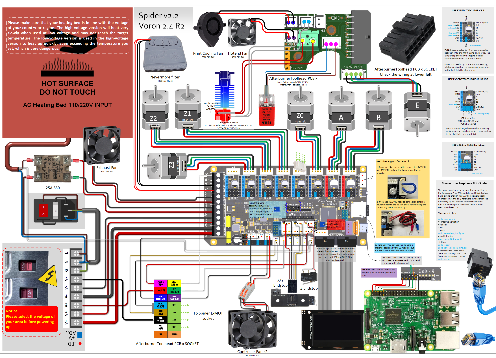
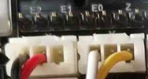

# FYSETC-VORON-2.4


## 1. Project

This is FYSETC's project database for VORON 2.4 kit, which is convenient for you to find information. Thanks for VORON Team's great work, they always design fantastic printers.

Official website:：https://vorondesign.com/voron2.4
Official Github：https://github.com/VoronDesign/Voron-2/tree/V2.4r2

In folder `Voron-2-Voron2.4` beside this README file, we make some small changes base on the VORON official material. Like change the board to Spider and others. 

## 2. BOM & Changes

Please check BOM [here](https://github.com/FYSETC/FYSETC-Voron-2/blob/main/BOM.md).

### VORON 2.4 R2

## 3. Extra parts

Besides the parts in Voron sourcing guide, we offer extra useful parts for you.

### Wire connector


This is for fans wire connection, with this connector you can wire two or more fans to one side of the connector, and the other side  to Spider board. Then you can control the two or more fans with one control pin in Spider.

## 4. Printed parts:

You can find all printed parts in VORON [website](https://vorondesign.com/voron2.4), VORON [github](https://github.com/VoronDesign/Voron-2).

Printed parts are not included in our VORON 2.4 kit. As VORON official provide you options on some particular printed part of the machine. Like the plug panel at the back of VORON machine, you can choose [plug_panel](https://github.com/VoronDesign/Voron-2/blob/Voron2.4/STLs/VORON2.4/Electronics_Compartment/Plug_Panel/plug_panel.stl) or [plug_panel_filtered_mains](https://github.com/VoronDesign/Voron-2/blob/Voron2.4/STLs/VORON2.4/Electronics_Compartment/Plug_Panel/plug_panel_filtered_mains.stl). So in our kit, we also need to choose too, below is our choice.

| Revision 1.0                                                                                                                                                                                                                                                                                                                                                                                                                                                                                                    | Revision 1.1                                                                                                                                                                                                                                                                                                                                                                                                                                                                                                    | Revision 1.2                                                                                                                                                                                                                                                                                                                                                                                                                                | Revision 1.3                                                                                                                                                                                                                                                                                                                                                                                                                                | R2                                                                                                                        |
| --------------------------------------------------------------------------------------------------------------------------------------------------------------------------------------------------------------------------------------------------------------------------------------------------------------------------------------------------------------------------------------------------------------------------------------------------------------------------------------------------------------- | --------------------------------------------------------------------------------------------------------------------------------------------------------------------------------------------------------------------------------------------------------------------------------------------------------------------------------------------------------------------------------------------------------------------------------------------------------------------------------------------------------------- | ------------------------------------------------------------------------------------------------------------------------------------------------------------------------------------------------------------------------------------------------------------------------------------------------------------------------------------------------------------------------------------------------------------------------------------------- | ------------------------------------------------------------------------------------------------------------------------------------------------------------------------------------------------------------------------------------------------------------------------------------------------------------------------------------------------------------------------------------------------------------------------------------------- | ------------------------------------------------------------------------------------------------------------------------- |
| [plug panel](https://github.com/VoronDesign/Voron-2/blob/Voron2.4/STLs/VORON2.4/Electronics_Compartment/Plug_Panel/plug_panel.stl), [Microswitch edge pod](https://github.com/VoronDesign/VoronUsers/blob/master/printer_mods/randell/Microswitch_Endstop/Microswitch_Edge_Pod.stl), [Z Chain mount part 1](https://github.com/FYSETC/FYSETC-Voron-2/blob/main/Z_Chain_Lower_Mount.STL), [Z Chain mount part 2](https://github.com/FYSETC/FYSETC-Voron-2/blob/main/Z_Chain_Upper_Mount.STL), Spider board mount | [plug panel](https://github.com/VoronDesign/Voron-2/blob/Voron2.4/STLs/VORON2.4/Electronics_Compartment/Plug_Panel/plug_panel.stl), [Microswitch edge pod](https://github.com/VoronDesign/VoronUsers/blob/master/printer_mods/randell/Microswitch_Endstop/Microswitch_Edge_Pod.stl), [Z Chain mount part 1](https://github.com/FYSETC/FYSETC-Voron-2/blob/main/Z_Chain_Lower_Mount.STL), [Z Chain mount part 2](https://github.com/FYSETC/FYSETC-Voron-2/blob/main/Z_Chain_Upper_Mount.STL), Spider board mount | [plug panel](https://github.com/VoronDesign/Voron-2/blob/Voron2.4/STLs/VORON2.4/Electronics_Compartment/Plug_Panel/plug_panel.stl), [Microswitch edge pod](https://github.com/VoronDesign/VoronUsers/blob/master/printer_mods/randell/Microswitch_Endstop/Microswitch_Edge_Pod.stl), [Z Chain mount part](https://github.com/VoronDesign/VoronUsers/tree/master/printer_mods/KiloQubit/VORON_2.4_Z_Chain_3_Hole_Mounts), Spider board mount | [plug panel](https://github.com/VoronDesign/Voron-2/blob/Voron2.4/STLs/VORON2.4/Electronics_Compartment/Plug_Panel/plug_panel.stl), [Microswitch edge pod](https://github.com/VoronDesign/VoronUsers/blob/master/printer_mods/randell/Microswitch_Endstop/Microswitch_Edge_Pod.stl), [Z Chain mount part](https://github.com/VoronDesign/VoronUsers/tree/master/printer_mods/KiloQubit/VORON_2.4_Z_Chain_3_Hole_Mounts), Spider board mount | [Microswitch_Z_Endstop_new_shorter](https://github.com/VoronDesign/Voron-Hardware/tree/master/Microswitch_Z_Endstop/STLs)[ERCF_pcb_cover_stock_afterburner](https://github.com/VoronDesign/Voron-Hardware/tree/master/Afterburner_Toolhead_PCB/STLs/Clockwork/Covers) |

## 5. Wiring

### 5.1 Spider 1.x wiring

There is wiring from VORON community [here](https://github.com/shiftingtech/Voron-Documentation/blob/Spider/build/electrical/v2_spider_wiring.md). Also you can refer Spider wiring [here](https://github.com/FYSETC/FYSETC-SPIDER#3-hardware-guide).

***Note: Check your fan voltage before you set the fan jumpers, the jumpers for fan in below diagram are all set to 24v.***


### 5.2 Spider v2.2 wiring

#### 5.2.1 VORON 2.4 kit wiring

If the pic is not clear enough, please check PDF file [here](https://github.com/FYSETC/FYSETC-Voron-2/blob/main/VORON2.4_SPIDER_V22_WIRING.pdf).


#### 5.2.2 VORON 2.4 R2 kit wiring

If the pic is not clear enough, please check PDF file [here](https://github.com/FYSETC/FYSETC-Voron-2/blob/main/VORON2.4R2_SPIDER_V22_Wiring_S.pdf).



If the pic is not clear enough, please check PDF type [here](https://github.com/FYSETC/FYSETC-Voron-2/blob/main/VORON2.4R2_SPIDER_V22_Wiring.pdf).

### 5.3 XY endstop



## 6. Firmware&OS

You can find example Klipper printer.cfg file on VORON github [here](https://github.com/VoronDesign/Voron-2/tree/Voron2.4/firmware/klipper_configurations/Spider) or our Spider github [here](https://github.com/FYSETC/FYSETC-SPIDER/blob/main/firmware/Klipper/printer.cfg) or gitee [here](https://gitee.com/fysetc-mirrors/FYSETC-SPIDER/tree/main/firmware/Klipper). And you can get our pre-build firmware and OctoPi system image in the `firmware&OS` folder next to this `README` file. 

### 6.1 OctoPi

We provide a SD card with OctoPi installed after rev1.1. You can login in Octoprint with the following account and password.

```
Account: FYSETC
Password: 12345678
```

Also we provide you Octopi OS system image for you, please check the README in `firmware&OS` folder.

OS SSH login account and password

```
Account: pi
Password: raspberry
```

## 7. Where to buy the kit

[Aliexpress](https://www.aliexpress.com/item/1005002782065110.html)
